# CSharp_WebApp_BookStore

@ March ~ April 2019 

The purpose of the application
 -------
 
This project is aimed to develop an online bookstore web application at the Visual C# and ASP.NET Core Framework environment. 

Description 
-----

It gives user instant access to books list and provides book information; book image, book title, price, quantity, book description, and the year for book published. In addition, the user can search for the desired book by book category or title. To order books, the user needs to register their account. User can keep their book list at their shopping cart, and the cart represent user’s book list when next login. While the user checks out books in their shopping cart and enter the shipping information they want, they can complete their order. User can check their order placed at their account page, modify the order details, and cancel their order as well before delivery. 

The project development environment
--------

	Language: C# 7.0

	Framework: ASP.NET Core

	IDE: Visual Studio 2017

	Database: MS-SQL server 2017

Technologies
------

	ADO.NET for SQL Server 2017 

	ASP.NET MVC and Web forms for Web Services

	Arrays and Collections for Data control

	Authentication and Authorization for User security

	Connected and Disconnected Database

	Exception handling

	Classes and Interfaces for OOP

	HTML5, CSS, JS, Bootstrap 4 for client side features

Database Structure
-----

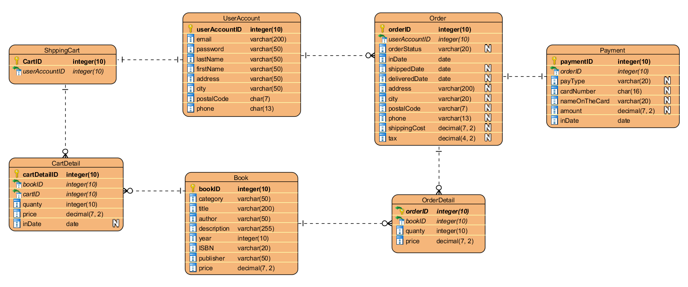

Class Design Diagram
----

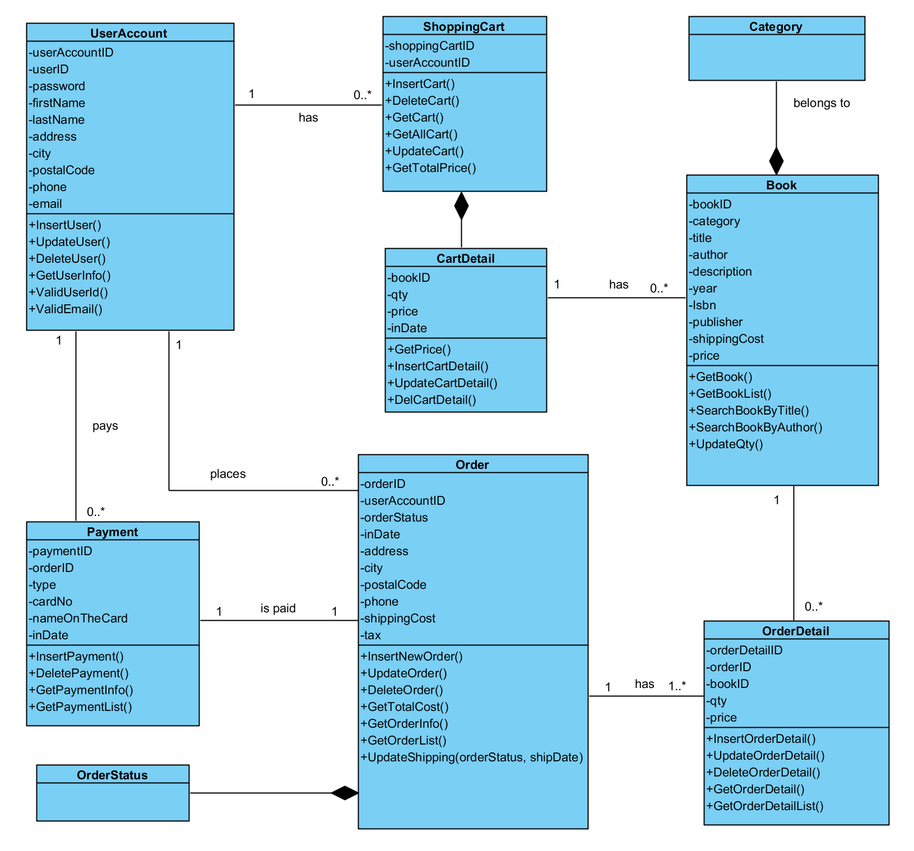

Page Features
------

<b>1. Intro Page</b>

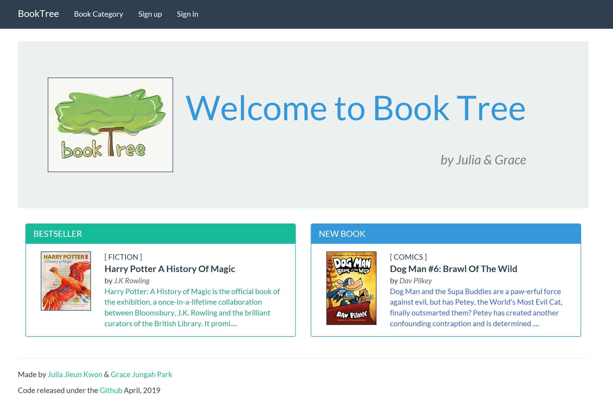

<b> Sign Up & Sign In
 
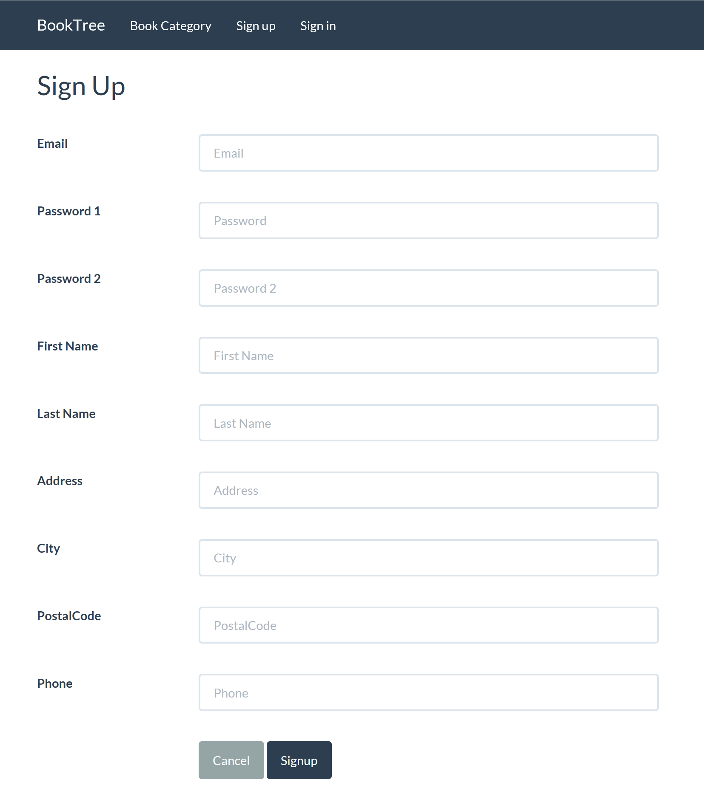

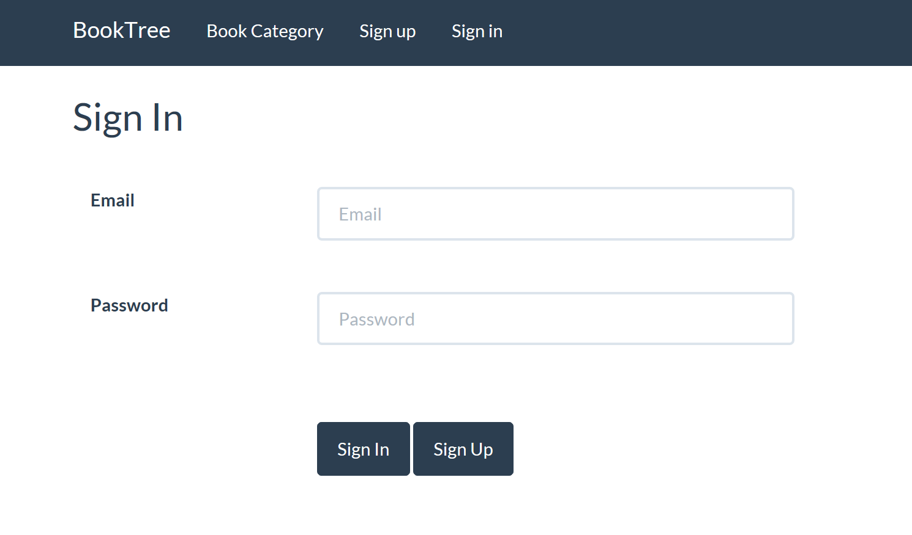

<b>2. View Books </b> 

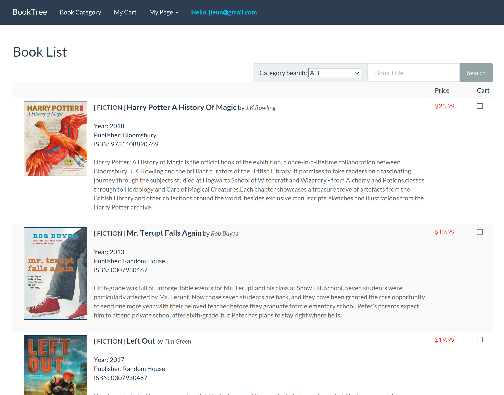

<b>3. View Book Details</b>

<b>4. My Shopping Cart </b>

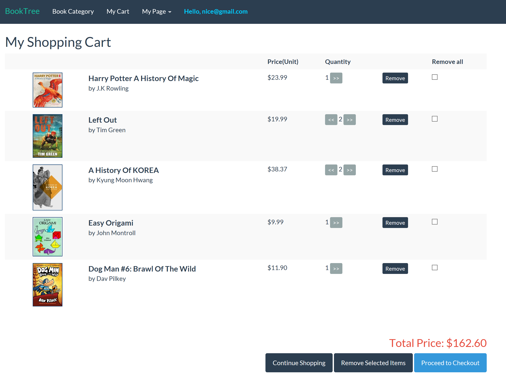

<b>5. Check out  </b>

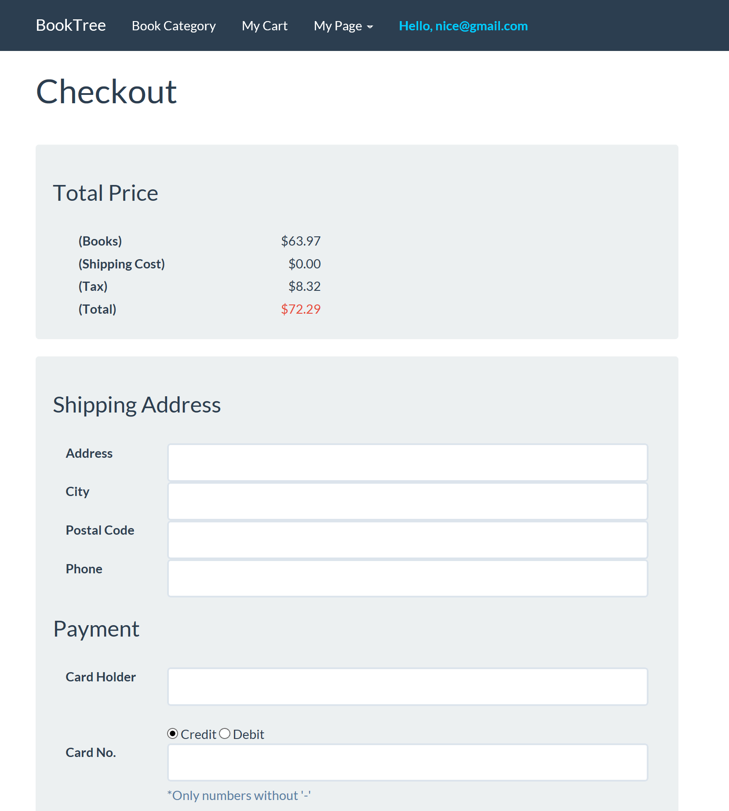

<b>6. Review Order</b>

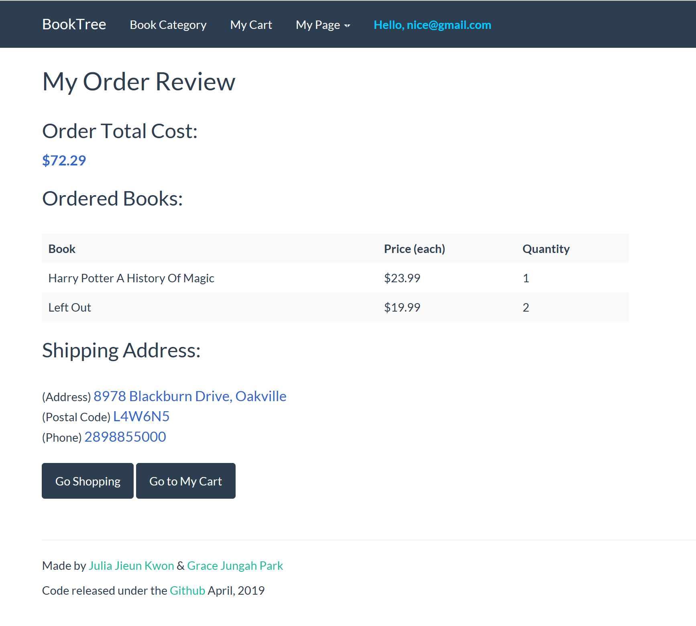

<b>7. My Orders History</b>

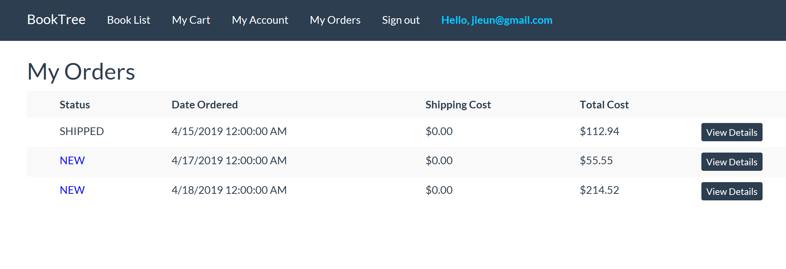

Admin Pages
------

<b>1. Add New Book</b>

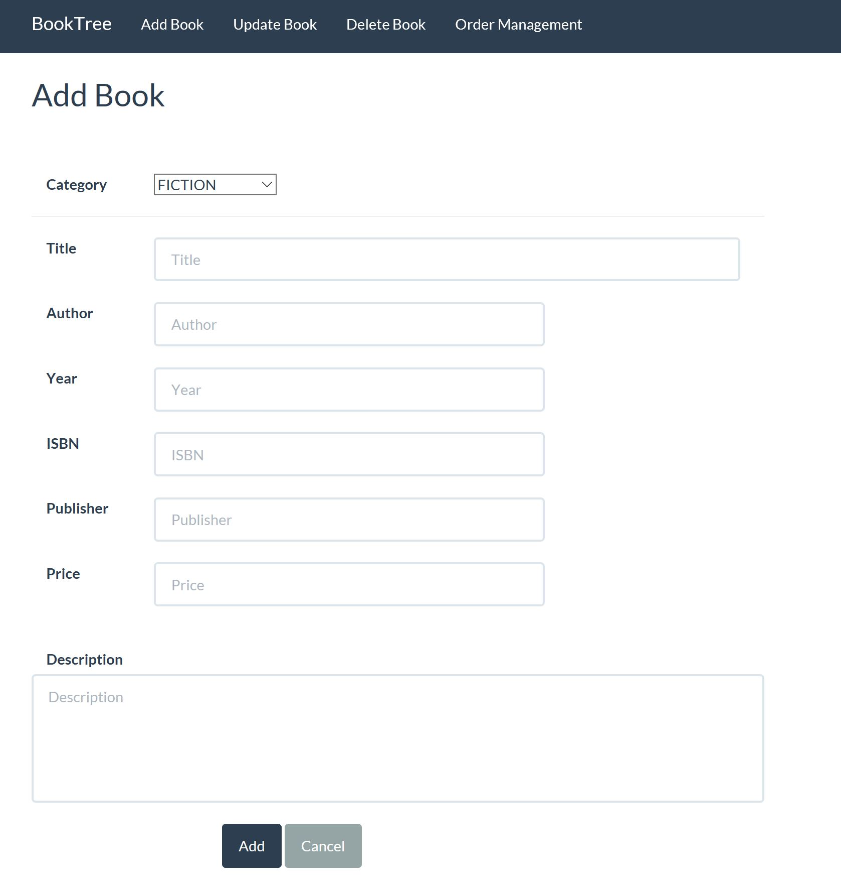

<b>2. View Books to update or delete book's information</b> 

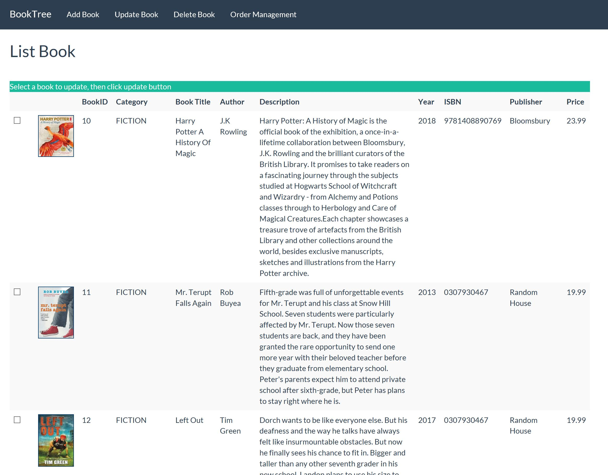

<b>3. View Orders to update order's transaction</b> 

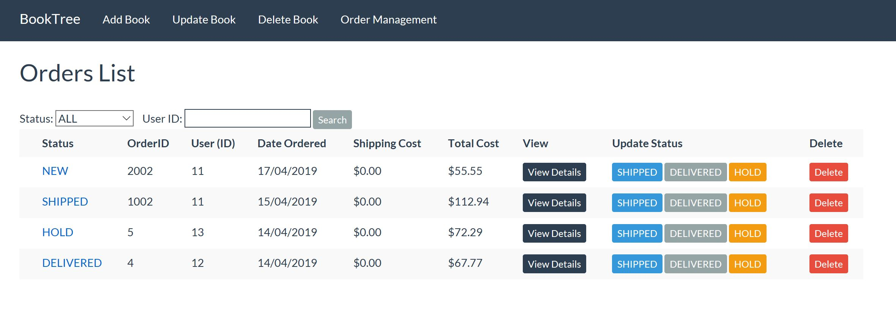
